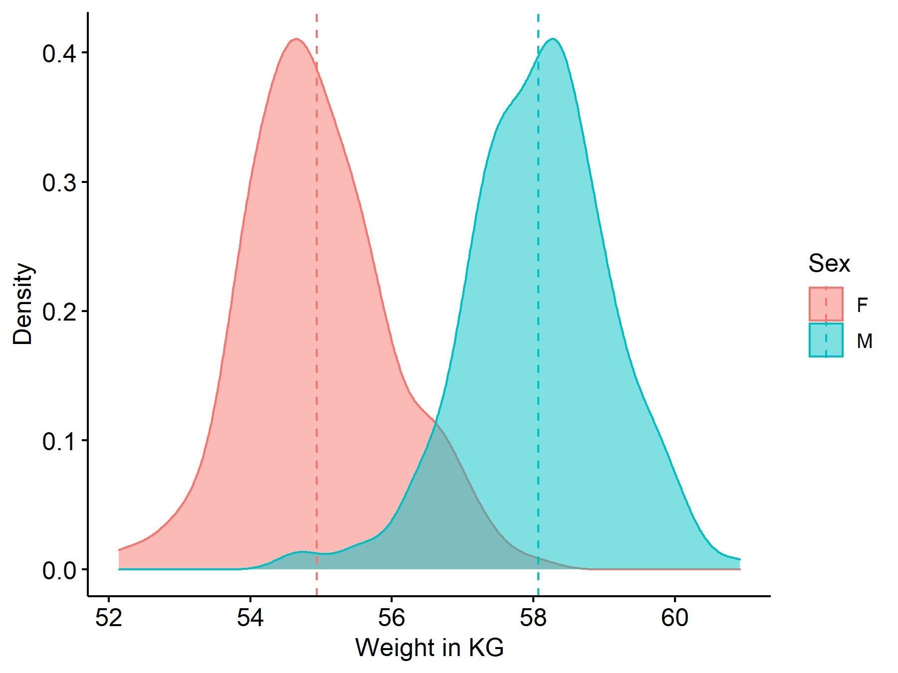

---
editor_options:
  chunk_output_type: console
---

# Results

<!--
When you want to bring in a table or figure from `~/results`, load them up at the top then refrence them below.
-->

```{r, include=F}
library(dplyr)
library(knitr)
library(kableExtra)
load('../results/analysis_1_of_n.RData')
```

Lorem ipsum dolor sit amet, consetetur sadipscing elitr, sed diam nonumy eirmod tempor invidunt ut labore et dolore magna aliquyam erat, sed diam voluptua.
At vero eos et accusam et justo duo dolores et ea rebum.
Stet clita kasd gubergren, no sea takimata sanctus est Lorem ipsum dolor sit amet.
Lorem ipsum dolor sit amet, consetetur sadipscing elitr,  sed diam nonumy eirmod tempor invidunt ut labore et dolore magna aliquyam erat, sed diam voluptua. At vero eos et accusam et justo duo dolores et ea rebum.
Stet clita kasd gubergren, no sea takimata sanctus est Lorem ipsum dolor sit amet.
Lorem ipsum dolor sit amet, consetetur sadipscing elitr,  sed diam nonumy eirmod tempor invidunt ut labore et dolore magna aliquyam erat, sed diam voluptua.
At vero eos et accusam et justo duo dolores et ea rebum.
Stet clita kasd gubergren, no sea takimata sanctus est Lorem ipsum dolor sit amet.

Using seed `r seed` the data summarized in Table Table \@ref(tab:mytable) and Figure \@ref(fig:myfigure) was generated.

```{r, mytable, echo = F}
# tables should come in raw form then have styling applied

sumary_data %>%
  kable(
    "latex",
    align = "c", 
    booktabs = T, 
    escape = F, 
    linesep = "",
    caption = "Differences in Weights Among the Sexes",
    col.names =
      c(
        "Sex",
        "Mean Weight (Kg)",
        "Standard Deviation"))%>%
    kable_styling()
```

Lorem ipsum dolor sit amet, consetetur sadipscing elitr, sed diam nonumy eirmod tempor invidunt ut labore et dolore magna aliquyam erat, sed diam voluptua.
At vero eos et accusam et justo duo dolores et ea rebum.
Stet clita kasd gubergren, no sea takimata sanctus est Lorem ipsum dolor sit amet.
Lorem ipsum dolor sit amet, consetetur sadipscing elitr,  sed diam nonumy eirmod tempor invidunt ut labore et dolore magna aliquyam erat, sed diam voluptua. At vero eos et accusam et justo duo dolores et ea rebum.
Stet clita kasd gubergren, no sea takimata sanctus est Lorem ipsum dolor sit amet.
Lorem ipsum dolor sit amet, consetetur sadipscing elitr,  sed diam nonumy eirmod tempor invidunt ut labore et dolore magna aliquyam erat, sed diam voluptua.
At vero eos et accusam et justo duo dolores et ea rebum.
Stet clita kasd gubergren, no sea takimata sanctus est Lorem ipsum dolor sit amet.

```{r, myfigure, echo = F, fig.cap = "Differences in Weights Among the Sexes", out.width = '70%'}
#figures should come in pre-rendered form


```

<!--
Figures like to float down.
Sometime a simple `\clearpage` can solve a lot of issues.
Don't over do it with formating early on.
Get the paper done then save the stuff that assd the least value till the end.
-->

\clearpage
